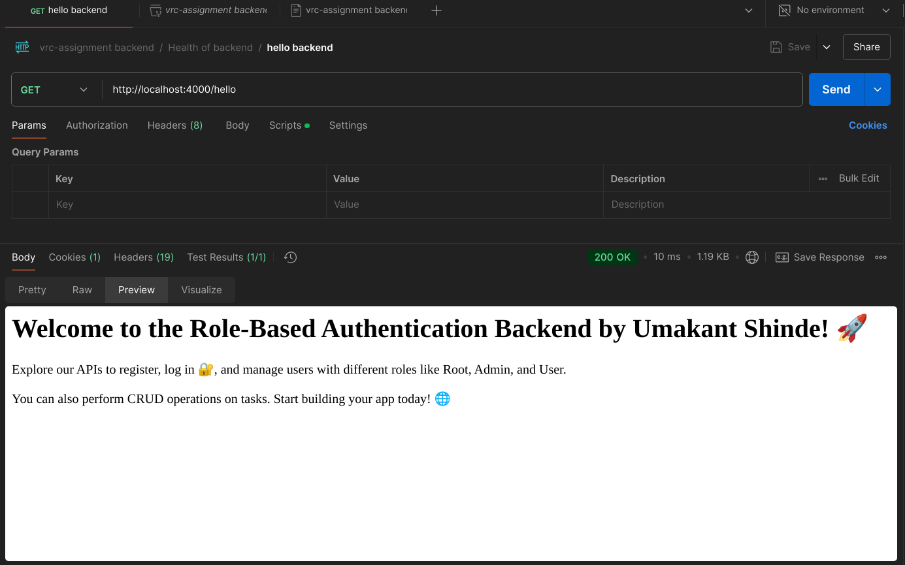

### 🪛 Getting Started

Follow these simple steps to get started with the project:

> **Create `.env` file** to manage environment variables for your project. For more details, refer to the **[env.md](env.md)** file.

---

## Installation

Before you begin, make sure the following software is installed on your system:

- **[Node.js](https://nodejs.org/en/download/)** - JavaScript runtime for building the server.
- **[MongoDB](https://www.mongodb.com/docs/manual/installation/)** - Database for storing user and task data.
- **[Redis](https://redis.io/download/)** - In-memory data store for caching.

---

## Run Locally

To clone and run the project locally, follow these steps:

1. **Clone the project**:

    ```bash
    gh repo clone https://github.com/umakant3525/vrc-assignment-.git
    ```

2. **Navigate to the project directory**:

    ```bash
    cd vrc-assignment-/backend
    ```

3. **Install the dependencies**:

    ```bash
    npm install
    ```

4. **Start the Redis server**:

    - Ensure Redis is installed and running by executing the following command:

    ```bash
    redis-server
    ```

5. **Start the server**:

    To run the development server, use:

    ```bash
    npm run dev
    ```

Your server should now be up and running locally.

---

<p align="center">
  <h3 align="center">Entity Relationship Diagram</h3>
  
</p>

---

## API Testing with Postman

To test the API endpoints, import the provided collection into your Postman workspace.

- **Postman Collection**: [Test API Collection Documentation Link](https://cloudy-station-320017.postman.co/workspace/My-Workspace~01d79ffe-e586-424b-8319-b20aa12fa944/collection/29744482-1ddb11ce-8b29-4b2e-80e2-b69ac742d3ab?action=share&creator=29744482)

<p align="center">
  <h3 align="center">Postman Test</h3>
  
</p>

Follow the collection to test various endpoints, including user authentication, task management, and role-based access control.

---

## Troubleshooting

If you encounter any issues during setup or while testing APIs, ensure:

- Redis is running before starting the server.
- MongoDB is properly set up and the required collections exist.
- Environment variables in the `.env` file are correctly configured.

For further assistance, feel free to open an issue or contact the project maintainer.
